<h1 align="center">🏦 CredAI</h1>

<h3 align="center">AI-Driven Dynamic Underwriting Using Alternative Data</h3>

<p align="center">
  <b>An explainable AI-powered loan underwriting platform designed to make lending<br/>more inclusive, transparent, and intelligent.</b>
</p>

<p align="center">
  
</p>

<p align="center">
  
  
  
  
  
  
  
  
  
</p>

<p align="center">
  
  
  
  
</p>

<p align="center">
  <a href="#-overview">Overview</a> •
  <a href="#-key-metrics">Metrics</a> •
  <a href="#-key-features">Features</a> •
  <a href="#-how-it-works">How It Works</a> •
  <a href="#-installation">Install</a> •
  <a href="#-rest-api">API</a> •
  <a href="#-roadmap">Roadmap</a>
</p>

---

## 📌 Table of Contents

- [Overview](#-overview)
- [Why CredAI](#-why-credai)
- [Key Metrics](#-key-metrics)
- [Key Features](#-key-features)
- [How It Works](#-how-it-works)
- [Risk Scoring](#-risk-scoring)
- [AI & Machine Learning](#-ai--machine-learning)
- [System Architecture](#-system-architecture)
- [Technology Stack](#-technology-stack)
- [Project Structure](#-project-structure)
- [Installation](#-installation)
- [Environment Variables](#-environment-variables)
- [REST API](#-rest-api)
- [Example Response](#-example-api-response)
- [Dashboard Modules](#-dashboard-modules)
- [Product Walkthrough (Screenshots)](#-product-walkthrough)
- [Roadmap](#-roadmap)
- [FAQ](#-faq)
- [Contributing](#-contributing)
- [Contributors](#-contributors)
- [License](#-license)

---

## 🌟 Overview

Traditional loan underwriting leans almost entirely on credit history — leaving **students, freelancers, gig workers, and first-time borrowers** locked out of fair access to credit.

**CredAI** bridges that gap. It fuses traditional financial data with **alternative data signals**, machine learning, fraud detection, and explainable AI to produce a **dynamic, transparent risk score** — and a clear, human-readable reason behind every decision.

<table align="center">
<tr>
<td align="center" width="20%">🎯<br/><b>Inclusive</b><br/><sub>Scores beyond credit history</sub></td>
<td align="center" width="20%">🔍<br/><b>Transparent</b><br/><sub>Every decision is explainable</sub></td>
<td align="center" width="20%">🚨<br/><b>Fraud-Aware</b><br/><sub>Flags duplicate identities</sub></td>
<td align="center" width="20%">📈<br/><b>Dynamic</b><br/><sub>Scores evolve with new data</sub></td>
<td align="center" width="20%">⚙️<br/><b>Configurable</b><br/><sub>Tunable weights & thresholds</sub></td>
</tr>
</table>

> ⚠️ **Disclaimer:** CredAI is an educational / prototype project. It should **not** be used for real lending decisions without proper validation, regulatory compliance, privacy protection, fairness testing, and human oversight.

---

## 💡 Why CredAI?

Millions of applicants have thin or no traditional credit files. Collected transparently and with consent, alternative signals can paint a fuller, fairer picture of creditworthiness.

<table>
<tr>
<th width="50%">📋 Traditional Data</th>
<th width="50%">🧩 Alternative Data</th>
</tr>
<tr>
<td>

- Credit score
- Monthly income
- Existing loans
- Employment status
- Loan repayment history
- Monthly expenses

</td>
<td>

- Education & certifications
- Employment stability
- Utility payment patterns
- Digital transaction behavior
- Professional profiles
- Publicly available career info

</td>
</tr>
</table>

All data is collected **transparently**, with **user consent**, and appropriate **privacy controls**.


---

## 📷 Product Walkthrough

A visual tour of CredAI end-to-end — from filling out a loan application to seeing the AI's explained decision, to the admin's portfolio-wide risk view.

### 🧾 1. The Applicant Journey — A 6-Step Guided Application

The `Apply` flow walks applicants through a clean, progress-tracked wizard. One-click demo profiles (*Tech Salaried*, *Freelancer*, *BITS Graduate*, *Fraud Risk Case*) let anyone instantly preview how different applicant types score — great for demos and testing edge cases.

<table>
<tr>
<td width="50%">

**Step 1 · Personal Information**
Full name, contact details, Aadhaar, PAN, and city — captured and validated against government ID formats.

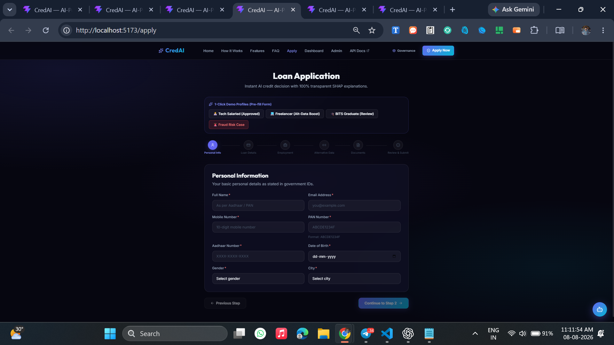

</td>
<td width="50%">

**Step 1 (filled) · Personal Information**
The same step pre-filled via a demo profile, showing real-time validation in action.

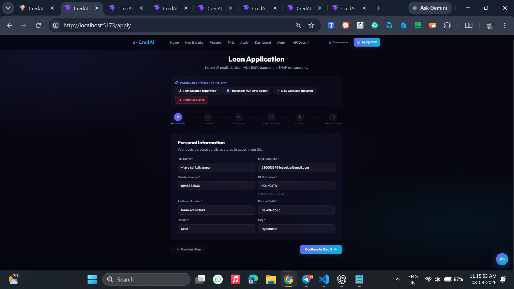

</td>
</tr>
<tr>
<td width="50%">

**Step 2 · Loan & Credit Details**
Loan amount, purpose, monthly income, CIBIL score slider, active loans, and EMI burden — the traditional underwriting inputs.

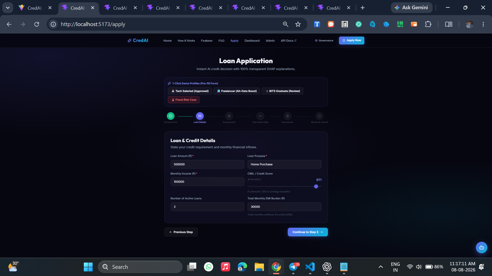

</td>
<td width="50%">

**Step 3 · Employment & Education**
Employment type, employer, years of experience, education level, and certifications — signals that feed the alternative-data score.

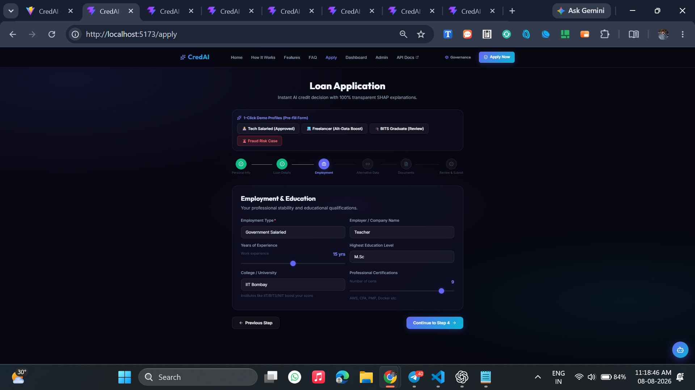

</td>
</tr>
<tr>
<td width="50%">

**Step 4 · Alternative Data Signals**
LinkedIn/GitHub profile links, bill-payment discipline score, monthly UPI transaction volume, and payment consistency — this is where CredAI goes beyond a credit bureau. A DPDP-compliance notice is shown inline.

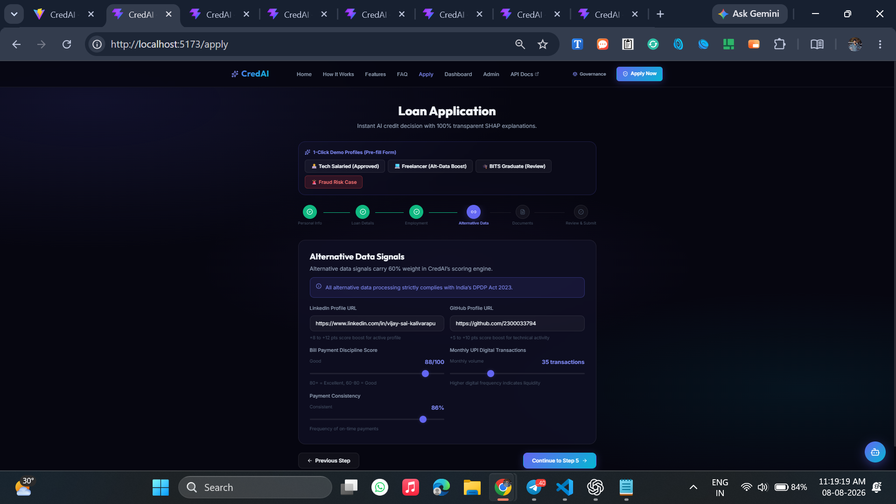

</td>
<td width="50%">

**Step 5 · Document Upload & Verification**
Aadhaar, PAN, bank statements, and salary slips are uploaded here — the intake point for the OCR/document-verification pipeline.

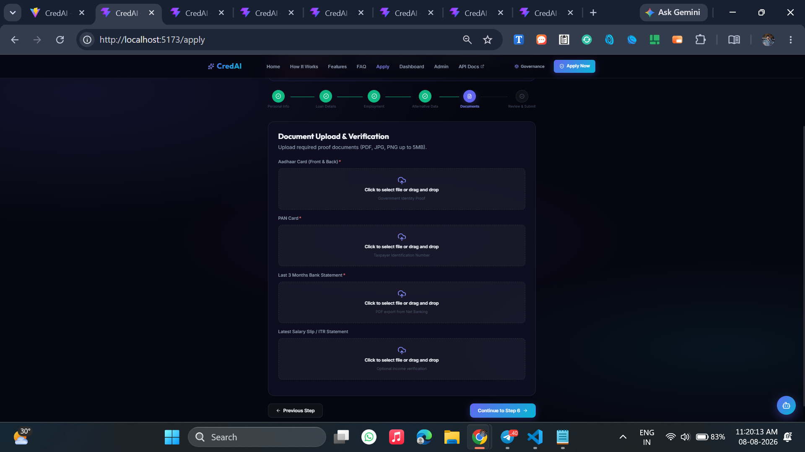

</td>
</tr>
</table>

**Step 6 · Review & Submit**
A full recap of every section — personal info, loan request, professional details, and alternative signals — plus an explicit, checkbox-based **DPDP Act 2023** consent statement (with links to the privacy policy, RBI lending norms, and the explainability standard) before the applicant can submit.

<p align="center">
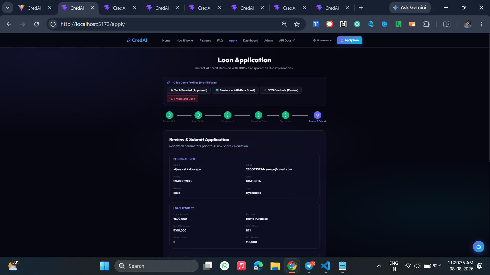
</p>
<p align="center">
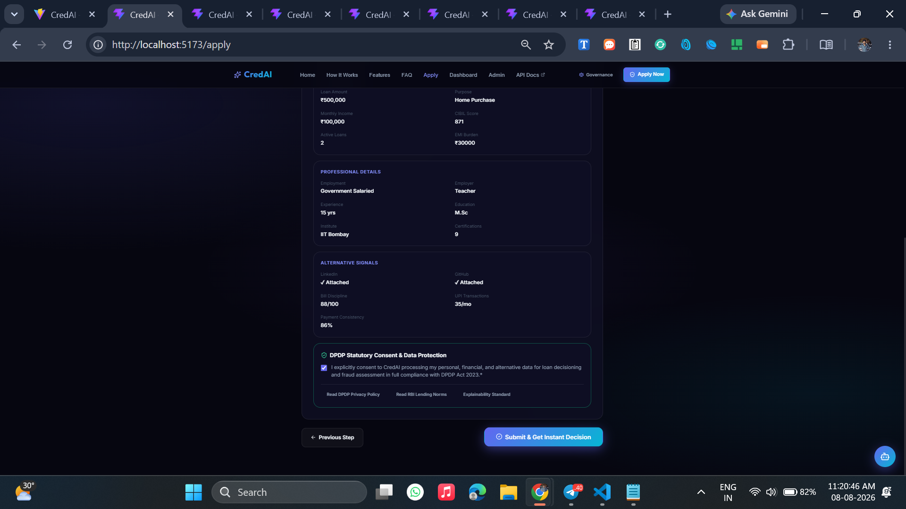
</p>

---

### 📊 2. The Applicant Dashboard — The Explained Decision

Once submitted, the applicant lands on a personal credit dashboard — the heart of CredAI's explainability promise.

<p align="center">
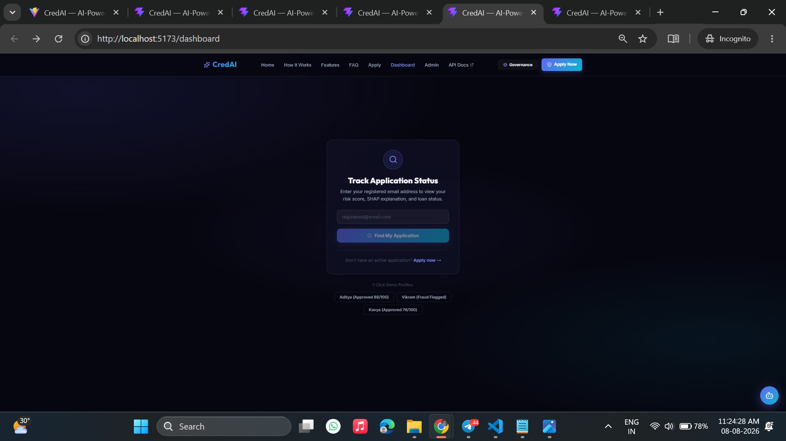
</p>
<p align="center"><i>Applicants can also look up an existing application any time using their registered email.</i></p>

The full result view shows a **0–100 AI Credit Risk Score** on a color-coded gauge, a **traditional vs. alternative data weight breakdown**, the raw application parameters, and a live **fraud-risk indicator** with the specific detected signal called out (e.g. *"Suspicious email pattern — possible bot-generated address"*).

<p align="center">
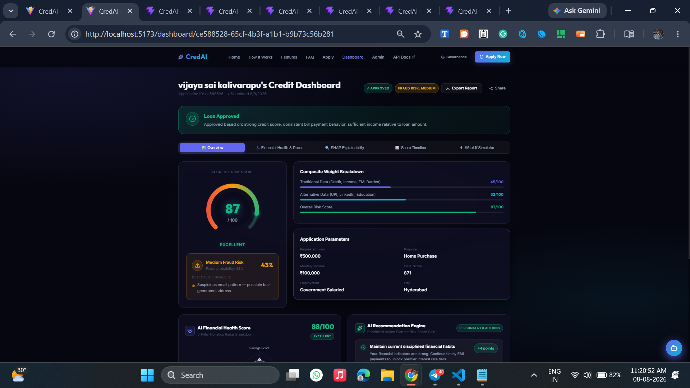
</p>

Scrolling further reveals the **AI Financial Health Score** — a 5-pillar radar chart (Savings, Income Stability, Expense Discipline, Debt Ratio, Investments) — alongside a **personalized AI Recommendation Engine** that gives the applicant concrete next steps to improve their score, and a **"what-if" EMI simulator** to test how timely vs. missed payments would move the score over time.

<p align="center">
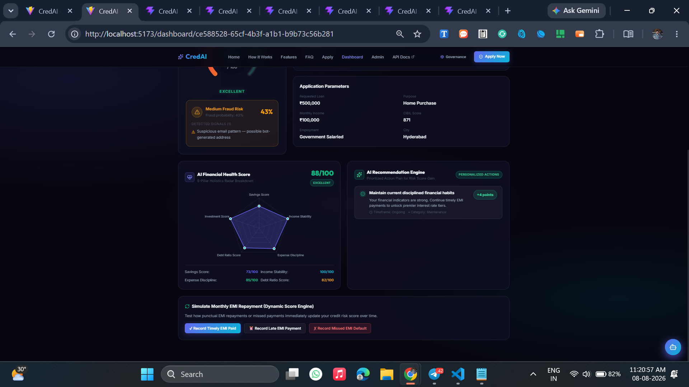
</p>

---

### 🛠 3. Admin Control Center — Portfolio-Wide Risk Analytics

Administrators get a real-time operations dashboard: total applications, approval rate, average risk score, and fraud rate at a glance, plus a **decision portfolio donut chart**, a **fraud severity breakdown**, and **average risk score by employment type** — everything needed to monitor the model's behavior across the whole applicant pool.

<p align="center">
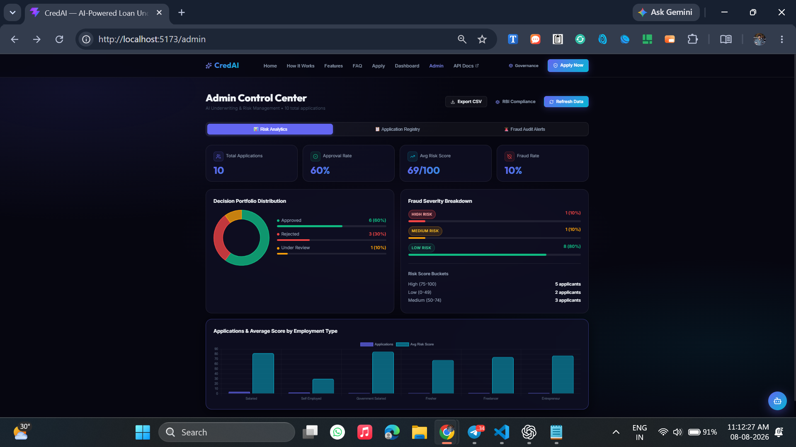
</p>

---

### ⚖️ 4. Built-In Regulatory Governance

CredAI treats compliance as a first-class feature, not an afterthought — with dedicated, always-visible governance modals covering the two regulatory pillars of Indian digital lending:

<table>
<tr>
<td width="50%">

**RBI Digital Lending Guidelines**
Direct disbursement & repayment, mandatory Key Fact Statements, transparent & auditable credit-decisioning logic, and a formal grievance-redressal path via the RBI Banking Ombudsman.

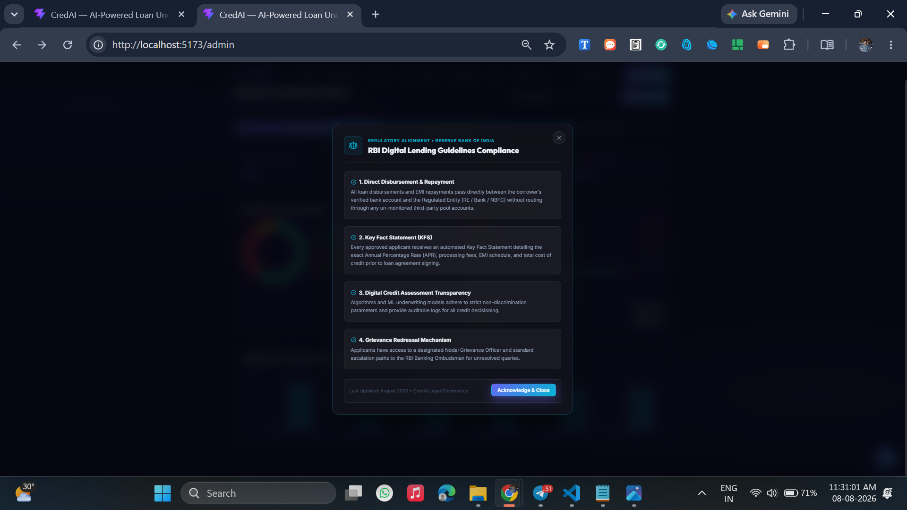

</td>
<td width="50%">

**Digital Personal Data Protection (DPDP) Act 2023**
Explicit consent & purpose limitation, applicant data-access/erasure rights, TLS 1.3 + AES-256 encryption with India-localized storage, and OAuth-authorized third-party data integrity.

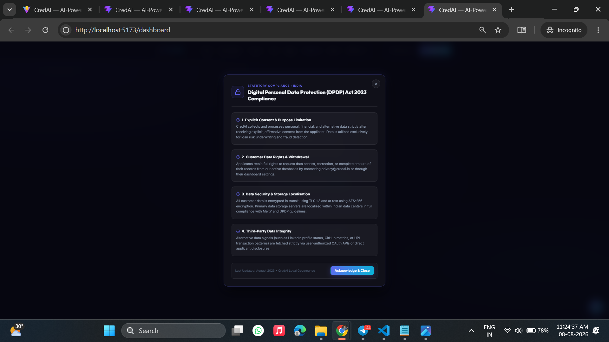

</td>
</tr>
</table>

---

### 👨‍💻 5. Development & Deployment

Built and shipped from VS Code — a real look at the project structure and a live `git push` deploying the frontend and backend to production.

<p align="center">

</p>

> 📁 All screenshots above live in [`frontend/assets/`](frontend/assets/) — replace or add to them as the product evolves.

---


---
## 📊 Key Metrics

<table align="center">
<tr>
<td align="center"><h3>0–100</h3><sub>Dynamic Risk Score Range</sub></td>
<td align="center"><h3>40 / 60</h3><sub>Traditional / Alternative Weighting</sub></td>
<td align="center"><h3>3</h3><sub>Decision Bands</sub></td>
<td align="center"><h3>9</h3><sub>REST API Endpoints</sub></td>
<td align="center"><h3>2</h3><sub>ML Models (XGBoost + Isolation Forest)</sub></td>
</tr>
</table>

---

## 🚀 Key Features

| Feature | Description |
|---|---|
| 👤 **Applicant Portal** | Register, log in, submit applications, upload documents, and track status in real time. |
| 🤖 **AI Underwriting** | ML-based risk prediction using both traditional and alternative features. |
| 📈 **Dynamic Risk Score** | Generates a 0–100 score that updates as applicant information changes. |
| 🔍 **Explainable AI** | Uses **SHAP** to surface exactly which factors drove a prediction. |
| ✨ **AI-Generated Explanations** | Converts raw model output into plain-language explanations via **Gemini**. |
| 🚨 **Fraud Detection** | Flags duplicate identities, suspicious applications, and anomalous behavior. |
| 📄 **Document Verification** | Extensible foundation for OCR and document validation. |
| 📊 **Admin Dashboard** | Review applications, risk scores, fraud alerts, and portfolio analytics. |
| 🔐 **Secure Authentication** | JWT-based auth protecting all user and admin routes. |
| 📱 **Responsive UI** | Mobile-friendly React frontend, built for every screen size. |

---

## 🔄 How It Works

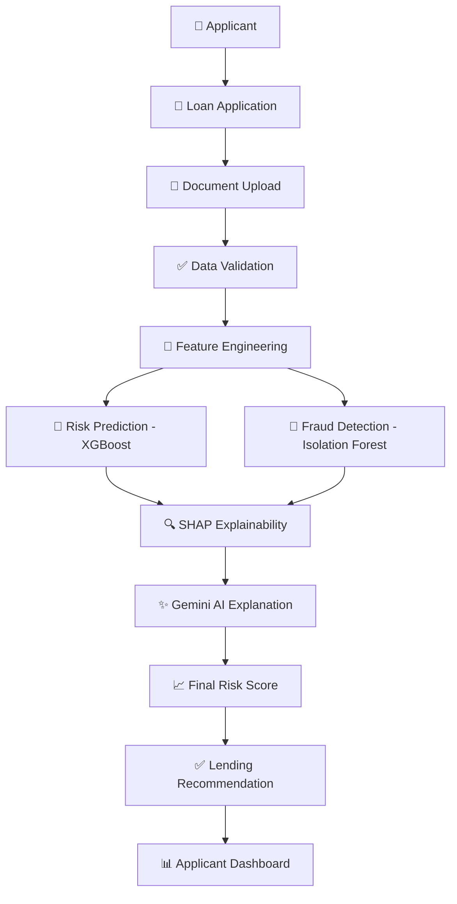

---

## 📈 Risk Scoring

CredAI blends traditional and alternative signals using a configurable weighted formula:

```text
Final Score = Traditional Score × 40%  +  Alternative Score × 60%
```

**Example calculation:**

```text
Traditional Score = 82
Alternative Score  = 91

Final Score = (82 × 0.40) + (91 × 0.60) = 87.4  →  ✅ Approved
```

### Decision Bands

| Score Range | Recommendation | Meaning |
|:---:|:---|:---|
| 🟢 75 – 100 | **Approved** | Strong applicant profile, low risk |
| 🟡 50 – 74 | **Manual Review** | Mixed signals, needs human judgment |
| 🔴 0 – 49 | **Rejected** | High risk indicators present |

> Thresholds and weights are fully configurable and should be validated on real datasets before any practical deployment.

---

## 🧠 AI & Machine Learning

| Technology | Purpose |
|---|---|
| **XGBoost** | Core loan risk prediction and classification model. |
| **Isolation Forest** | Unsupervised detection of unusual/fraudulent applications. |
| **SHAP** | Explains each feature's contribution to a prediction. |
| **Google Gemini** | Turns model output into natural-language explanations. |
| **Feature Engineering** | Converts raw applicant data into model-ready signals. |

**Sample generated explanation:**

```text
Your application received a high risk score because:

✅ Positive Factors
  • Stable employment history
  • Consistent monthly income
  • Low existing debt
  • Regular utility payments

⚠️ Risk Factors
  • Existing personal loan
  • Limited emergency savings
  • Recent change in employment
```

---

## 🏗 System Architecture

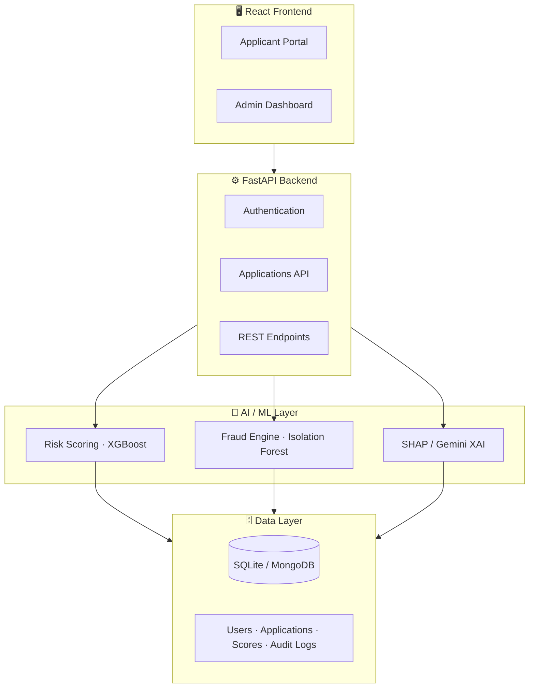

---

## 🛠 Technology Stack

<p align="center">
  
</p>

<table>
<tr>
<th>Layer</th>
<th>Technologies</th>
</tr>
<tr>
<td><b>Frontend</b></td>
<td>React 18 · JavaScript / TypeScript · Responsive UI · Charting & Analytics</td>
</tr>
<tr>
<td><b>Backend</b></td>
<td>Python 3.11 · FastAPI · JWT Auth · RESTful API design</td>
</tr>
<tr>
<td><b>Machine Learning</b></td>
<td>XGBoost · Scikit-learn · SHAP · Pandas · NumPy</td>
</tr>
<tr>
<td><b>Database</b></td>
<td>SQLite (local MVP) · MongoDB (scalable deployment)</td>
</tr>
</table>

---

## 📂 Project Structure

```text
CredAI/
├── frontend/
│   ├── src/
│   ├── public/
│   ├── package.json
│   └── README.md
│
├── backend/
│   ├── app/
│   │   ├── main.py
│   │   ├── models/
│   │   ├── schemas/
│   │   ├── routes/
│   │   ├── services/
│   │   └── utils/
│   ├── requirements.txt
│   └── .env.example
│
├── datasets/
├── models/
├── docs/
├── screenshots/
├── tests/
├── .gitignore
├── README.md
└── LICENSE
```

---

## ⚙️ Installation

### 1️⃣ Clone the Repository

```bash
git clone https://github.com/2300033794/CredAI.git
cd CredAI
```

### 2️⃣ Set Up the Backend

```bash
cd backend
python -m venv venv
```

**Windows**
```bash
venv\Scripts\activate
```

**macOS / Linux**
```bash
source venv/bin/activate
```

Install dependencies and start the server:

```bash
pip install -r requirements.txt
uvicorn app.main:app --reload
```

| Service | URL |
|---|---|
| Backend API | `http://127.0.0.1:8000` |
| Interactive Docs | `http://127.0.0.1:8000/docs` |

### 3️⃣ Set Up the Frontend

```bash
cd frontend
npm install
npm run dev
```

| Service | URL |
|---|---|
| Frontend App | `http://localhost:5173` |

---

## 🔑 Environment Variables

Create a `.env` file inside `backend/`:

```env
APP_ENV=development

JWT_SECRET=replace_with_a_secure_secret

GEMINI_API_KEY=replace_with_your_api_key

DATABASE_URL=sqlite:///./credai.db

MONGO_URI=mongodb://localhost:27017/credai
```

> 🔒 Never commit real credentials, API keys, private documents, or production secrets to GitHub.

---

## 📡 REST API

| Method | Endpoint | Description |
|:---:|---|---|
| `POST` | `/auth/register` | Create a new user account |
| `POST` | `/auth/login` | Authenticate a user |
| `POST` | `/applications` | Submit a loan application |
| `GET` | `/applications/{id}` | Retrieve application details |
| `GET` | `/score/{id}` | Retrieve the applicant risk score |
| `GET` | `/fraud/{id}` | Retrieve fraud detection results |
| `GET` | `/dashboard` | Retrieve applicant dashboard data |
| `GET` | `/admin/applications` | View applications (admin) |
| `PATCH` | `/admin/applications/{id}` | Update an application decision |

---

## 🧪 Example API Response

```json
{
  "application_id": "CRD-1001",
  "risk_score": 86,
  "decision": "Approved",
  "fraud_status": "Low Risk",
  "explanation": {
    "positive_factors": [
      "Stable employment",
      "Consistent monthly income",
      "Low existing debt"
    ],
    "risk_factors": [
      "Limited emergency savings"
    ]
  }
}
```

---

## 📊 Dashboard Modules

<table>
<tr>
<td>

- 📥 Total applications
- ✅ Approved applications
- 🕓 Applications in manual review
- ❌ Rejected applications

</td>
<td>

- 📉 Average risk score
- 🚨 Fraud alerts
- 📊 Risk distribution charts
- 🧾 Recent activity feed

</td>
<td>

- 🔍 Explainability reports
- 🗂️ Administrator audit logs

</td>
</tr>
</table>


## 🛣 Roadmap

**Shipped**
- ✅ JWT authentication
- ✅ Applicant registration & login
- ✅ Loan application workflow
- ✅ Initial risk scoring engine
- ✅ Fraud detection prototype
- ✅ SHAP-based explainability

**In Progress**
- 🔄 Dynamic monthly score updates
- 🔄 OCR-based document processing
- 🔄 Improved model evaluation & fairness testing
- 🔄 Bank statement & transaction analysis
- 🔄 Cloud deployment

**Planned**
- ⏳ Real-time notifications
- ⏳ Mobile application
- ⏳ Multi-language support
- ⏳ Integration with verified credit data providers

---

## ❓ FAQ

<details>
<summary><b>Is CredAI production-ready?</b></summary><br/>
No. It's an educational prototype. Real deployment requires regulatory compliance, fairness audits, privacy safeguards, and human oversight.
</details>

<details>
<summary><b>Can I change the scoring weights?</b></summary><br/>
Yes — the 40/60 traditional/alternative split and decision-band thresholds are configurable in the backend scoring service.
</details>

<details>
<summary><b>What database should I use?</b></summary><br/>
SQLite is ideal for local development and demos. MongoDB is recommended for scalable, multi-user deployments.
</details>

<details>
<summary><b>How does the explainability layer work?</b></summary><br/>
SHAP computes per-feature contributions to each prediction, which are then translated into plain-language summaries by Gemini.
</details>

---

## 🤝 Contributing

Contributions are welcome!

```bash
# 1. Fork the repository
# 2. Create a feature branch
git checkout -b feature/your-feature

# 3. Make your changes, then commit
git commit -m "Add your feature"

# 4. Push and open a Pull Request
git push origin feature/your-feature
```

> ⚠️ Please avoid including sensitive personal, financial, identity, or authentication data in issues, commits, datasets, or pull requests.

---

## 👨‍💻 Contributors

**Vijaysai Kalivarapu**
B.Tech Computer Science · AI · Full Stack Development · Machine Learning

---

## 📜 License

Licensed under the **MIT License** — see the [LICENSE](LICENSE) file for details.

---

<div align="center">

### ⭐ If you found CredAI useful, consider starring the repository!

**Built with ❤️ using React · FastAPI · Python · Machine Learning · Explainable AI**


</div>
